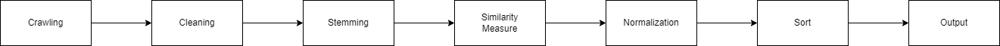

# SNS 리뷰 기반 추천 시스템(Recommended model based on SNS review)

## Introduction
사용자가 원하는 키워드를 입력하면 장소를 추천해주는 모델입니다(이 모델은 제주도 한정입니다). 입력받을 수 있는 키워드의 항목을 정리하면 다음과 같습니다.
1. 좋았다, 나빴다를 비롯한 역대급, 최고, 최악 등의 감정을 나타내는 형용사
2. 부모님, 지인, 반려동물 등 수를 나타내는 명사
3. 휴양지, 관광지, 음식점 등의 장소 자체의 업종 분류를 나타내는 명사

블로그, SNS, 공공데이터 등의 각종 매체 크롤링을 통해 데이터를 수집, 가공, 전처리, 정규화, 분석을 통해 입력받은 키워드와 가장 유사한 항목들을 나타냅니다. 분류할 수 있는 카테고리로는 관광지, 음식점과 숙박이 있습니다.

## Requirnments
```
selenium==3.141.0
konlpy==0.5.2
folium==0.12.1
gensim==4.0.1
scikit-learn==0.18.1
pandas==1.3.0
```

## Output


## Sequence


## Dataset
수집한 사이트 목록:
1. 네이버 블로그, 카페(https://www.naver.com/)
2. 비짓제주(https://www.visitjeju.net/kr/)
3. 트립어드바이저(https://www.tripadvisor.co.kr/)
4. 공공데이터포털(https://www.data.go.kr/)
5. 인스타그램(https://www.instagram.com/)

## Crawling
다음과 같은 방식으로 크롤링하였습니다.
```python
#크롤링할 페이지
URL = 'https://www.visitjeju.net/kr/#'
driver = starting(URL) #드라이버 정보 저장하기
df = pd.DataFrame() #빈 데이터프레임 생성
count=0 #진행과정을 보기 위해서 만든 변수
for link_data in link_list:
    driver.get(link_data)
    driver.implicitly_wait(5)
    
    section = driver.find_element_by_class_name('p_depth').text.split('>')[1] #장소분류
    name = driver.find_element_by_class_name('sub_info_title').text.replace('\n','') #장소이름
    add = driver.find_element_by_class_name('info_sub_cont').text #장소주소
    hesh = driver.find_element_by_class_name('tag_area').text.split('\n') #장소 해시태그
    i_data = driver.find_elements_by_class_name('add2020_detail_side_info') #이용안내 데이터
    heshlist = [] #해시태그 저장할 배열
    for i in hesh: #해시태그 가공
        heshlist.extend(i.split('#')[1:])

    for i in i_data:
        i_arr = i.text.split('\n')

    m_data_dic = show_dic() #조회관련 사전타입 배열
    linked_point_dic = linked_point_data(driver, name) #주변포인트 반환타입:사전
    sub_dic = array_return(i_arr, name) #이용안내 데이터

    dit = {'타입':section,'장소':name,'위치':add,'해시태그':heshlist}
    dit.update(m_data_dic)
    dit.update(linked_point_dic)
    dit.update(sub_dic)

    df = df.append(dit, ignore_index=True)
    print(count)
    count+=1

ending(driver)
```
위의 코드와 연관된 파일을 보려면 아래 표를 참고하세요
|File Name|Crawling site|
|:-------:|:-----:|
|[AutoCrow.ipynb](./연습포함/AutoCrow.ipynb)|비짓제주|
|[BlogCrawl.ipynb](./연습포함/BlogCrawl.ipynb)|네이버|
|[크롤링_review.ipynb](./연습포함/크롤링_review.ipynb)|네이버|

## Cleaning
중복된 링크나 비공개글을 제외하는 작업을 거쳤습니다.
```python
data1 = pd.read_csv('''link''')
data1.drop('Unnamed: 0', axis=1, inplace=True)

data2 = pd.read_csv('''link''')
data2.drop('Unnamed: 0', axis=1, inplace=True)
```

위의 코드와 연관된 파일을 보려면 아래 표를 참고하세요
|File Name|Purpose|
|:-------:|:-----:|
|[conv_list.ipynb](./연습포함/conv_list.ipynb)|중복링크 제거|

## Stemming
사이트로부터 얻은 텍스트에서 명사만 추출하는 작업을 수행하였습니다.
```python
n=0
result = []
for i in f_data.data:
    n+=1
    if n%1000==0:
        print(n)
    line_s = i.split('\n')

    for line in line_s:
        tokenlist = okt.pos(line, stem=True, norm=True)
        temp=[]
        for word in tokenlist:
            if word[1] in ["Noun"]: # 명사일 때만
                temp.append((word[0])) # 해당 단어를 저장함
        if temp: # 만약 이번에 읽은 데이터에 명사가 존재할 경우에만
            result.append(temp) # 결과에 저장
            
conv_data = np.array(result, dtype=object)
np.save('word_noun_list',conv_data)
```

위의 코드와 연관된 파일을 보려면 아래 표를 참고하세요
|File Name|Purpose|
|:-------:|:-----:|
|[okt_embed.ipynb](./연습포함/okt_embed.ipynb)|명사추출|
|[M_word.ipynb](./연습포함/M_word.ipynb)|명사추출|

## Similarity Measure
명사 추출한 데이터를 바탕으로 한 장소에 대한 sns 데이터의 단어간의 유사도(벡터)를 측정합니다.
```python
for v in vc:
    for w in wd:
        for m in mc:
            model = Word2Vec(result, vector_size=v, window=w,
                             min_count=m, workers=14, sg=1, epochs=5)

            for name in u_list:
                w_list = []
                t_list = []
                try:
                    for para in who_with:
                        sim = model.wv.similarity(name, para)
                        w_list.append(sim)

                    for para in taste:
                        sim = model.wv.similarity(name, para)
                        t_list.append(sim)

                except:
                    print(name)
                r_df = r_df.append(dic_maker(who_with, w_list, taste, t_list, name), ignore_index=True)
```

위의 코드와 연관된 파일을 보려면 아래 표를 참고하세요
|File Name|Purpose|
|:-------:|:-----:|
|[cosin.ipynb](./연습포함/cosin.ipynb)|코사인 유사도 측정|

## Normalization
앞서 구한 유사도를 0~1 사이의 값으로 정규화 합니다.
```python
from sklearn.preprocessing import MinMaxScaler

scaler = MinMaxScaler()
scaler.fit(data)
data_scaled = scaler.transform(data)
data_df_scaled = pd.DataFrame(data=data_scaled, columns=data.columns, index=data.index)
data_df_scaled
```

위의 코드와 연관된 파일을 보려면 아래 표를 참고하세요
|File Name|Purpose|
|:-------:|:-----:|
|[nomalize.ipynb](./연습포함/nomalize.ipynb)|정규화|

## Sort
사용자의 입력을 넣고 결과를 출력합니다.
```python
finder = ['연인','둘','드라이브','산책']
f_data = data_df_scaled.sort_values(by=finder, ascending=False)
f_data
```

위의 코드와 연관된 파일을 보려면 아래 표를 참고하세요
|File Name|Purpose|
|:-------:|:-----:|
|[Com_code.ipynb](./연습포함/Com_code.ipynb)|정렬|

## 더 자세한 설명은 아래 깃 블로그에 있습니다...

https://ponopono0322.github.io/categories/#ml